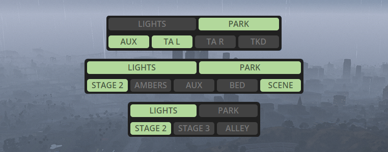

# Stage Controls

<figure><figcaption></figcaption></figure>

Stage controls allow the driver of the vehicle to dynamically switch between extras at the press of a button using the number pad. This is not a new concept to vehicle developers, but ULC focuses on a great user experience, and flexibility.

You can individually assign each extra you want to use to any numpad key, and assign a custom label to it.

Only the keys you define will appear on the UI, and the extras are bound to them individually.

**Example Usage**

* Traffic Advisors
* Flood/Scene/Alley Lighting
* Alternative Patterns
* Stage 2 Lighting
* Much more!

Any stages you create can also be used by any other feature of the resource. For example, if you create a stage extra that has an alternate pattern, you can then use that pattern as your brake pattern.

Stages are fully state aware, meaning if your alt pattern was enabled before you started braking, it will remain on after you finish braking. The same logic applies other features, except park patterns.

**How to Create a Stage**

The hardest part of creating stages is planning out your vehicle. Sirens parented to extras only show when the extra is enabled, so those Sirens are effectively eliminated from your workflow. They can't be re-used anywhere else.

This can have you pretty short on sirens if you commit too many of them to extras that aren't used often. Siren Tool can help you with planning out your vehicle to be very efficient with sirens.

Other than that, the process is pretty straight forward.

* Compound sirens as usual
* Parent sirens to your extra

**Vehicle Stage Config**

**Example Button**

```lua
{   -- the name/label that will show on the UI
    label = 'STAGE 2',
    -- which numpad key the stage will use by default
    -- players can remap these keys on their own
    key = 5,
    -- the extra that this key will toggle
    extra = 8,
    -- extras that will toggle along with the main extra
    linkedExtras = {9, 10},
    -- extras that will turn off when stage activates
    offExtras = {6, 7}
},
```

**Example Configuration**

Each vehicle can have a minimum of 0 buttons, and a maximum of 9. Any buttons not configured will not show.

Buttons cannot share the same primary extra.

Keys don't have to be used in order or sequentially. You could use 5, 3, 1, 7, 2 if you wanted. However, they will render on the UI in ascending order left to right.


Example:&#x20;

```lua
buttons = {
    {label = 'STAGE 2', key = 1, extra = 8, linkedExtras = {10, 11}, offExtras = {}},
    {label = 'TA', key = 2, extra = 9, linkedExtras = {}, offExtras = {}},
    {label = 'AUX1', key = 3, extra = 10, linkedExtras = {}, offExtras = {}},
    {label = 'AUX 2', key = 4, extra = 11, linkedExtras = {}, offExtras = {}},
    {label = 'SCENE', key = 5, extra = 12, linkedExtras = {}, offExtras = {8}},
}
```
