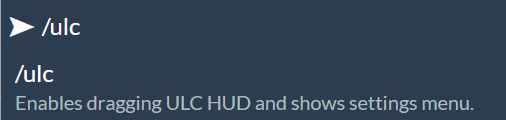

# In-Game Usage

<figure><figcaption></figcaption></figure>

ULC includes an intuitive menu with easy-to-use controls to change various settings. To access the menu you can use `/ulc`!

## Commands

| Command     | Effect                                                   |
| ----------- | -------------------------------------------------------- |
| `/ulc`      | Displays the settings menu and enables dragging the HUD. |
| `/ulcReset` | Wipes all user-preferences and sets default values.      |

## Key-binds

Default key-bindings are numpad 1-9. You can change these in your game settings.
