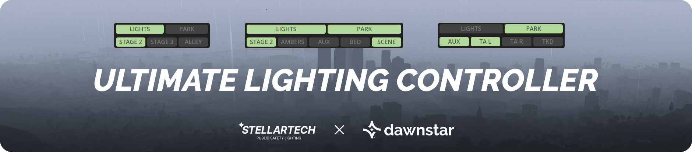
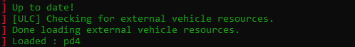

# Getting Started

<figure><figcaption></figcaption></figure>

## ULC Overview

ULC is an all-in-one lighting controller for Non-ELS vehicles in FiveM! It uses the extra-based lighting stages on your vehicles and adds extra automation and improvements to create amazing, realistic, and fully configurable lighting controls.

The resource aims to make it as seamless as possible for vehicle developers to share ULC functionality with users of their vehicles. Vehicle developers can include a config file with their resource, and users can plug-and-play by adding the vehicle resource name to their ULC resource.


See something wrong? Create an issue or edit on GitHub!


## Preview



ULC focuses on being as customizable as possible, to fit every possible scenario. You can individually configure every vehicle you choose to use this resource with.

Each vehicle can use just one feature, or 3, or all of them. It's completely up to you.'

### Performance



<figure><figcaption></figcaption></figure>




<figure><figcaption></figcaption></figure>




## Installation

1. [Download the latest release from here](https://github.com/Flohhhhh/ultimate-lighting-controller/releases)
2. Extract `ulc` and place it in your resources folder
3. Add `ensure ulc` to your `server.cfg`


This resources requires the `baseevents` default resource to be started!


## Learn How to Use ULC

<table data-view="cards"><thead><tr><th></th><th></th><th></th><th data-hidden data-card-target data-type="content-ref"></th></tr></thead><tbody><tr><td><h3>Server Owners</h3></td><td>Learn how to configure ULC for your server.</td><td></td><td><a href="configuration/#adding-vehicle-configurations-to-a-server">#adding-vehicle-configurations-to-a-server</a></td></tr><tr><td><h3>Vehicle Devs</h3></td><td>Learn how to configure vehicles for ULC.</td><td></td><td><a href="configuration/#configuring-vehicles-for-ulc">#configuring-vehicles-for-ulc</a></td></tr></tbody></table>
